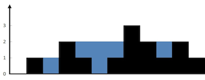

# DESAFIO LÓGICA
## Meta TI

As questões abaixo podem ser solucionadas na linguagem de sua preferência.
Tente resolver o maior numero de questões que conseguir.

**01 - QUESTÃO**

Dado um array de números inteiros, retorne os índices dos dois números de forma que eles se
somem a um alvo específico.
Você pode assumir que cada entrada teria exatamente uma solução, e você não pode usar o
mesmo elemento duas vezes.

*Exemplo:*
```
Dado nums = [2, 7, 11, 15], alvo = 9,
Como nums[0] + nums[1] = 2 + 7 = 9,
return [0, 1].
```

**02 – QUESTÃO**

Um bracket é considerado qualquer um dos seguintes caracteres: (, ), {, }, [ ou ].
Dois brackets são considerados um par combinado se o bracket de abertura (isto é, (, [ou {) ocorre à esquerda de um
bracket de fechamento (ou seja,),] ou} do mesmo tipo exato.
Existem três tipos de pares de brackets : [], {} e ().
Um par de brackets correspondente não é balanceado se o de abertura e o de fechamento não corresponderem entre
si. Por exemplo, {[(])} não é balanceado porque o conteúdo entre {e} não é balanceado.
O primeiro bracket inclui o de abertura, (, e o segundo inclui um bracket de fechamento desbalanceado,].
Dado sequencias de caracteres, determine se cada sequência de brackets é balanceada. Se uma string estiver
balanceada, retorne SIM. Caso contrário, retorne NAO.

*Exemplo:*
```
{[()]} SIM
{[(])} NAO
{{[[(())]]}} SIM
```

**03 – QUESTÃO**

Digamos que você tenha um array para o qual o elemento i é o preço de uma determinada ação
no dia i.
Se você tivesse permissão para concluir no máximo uma transação (ou seja, comprar uma e
vender uma ação), crie um algoritmo para encontrar o lucro máximo.
Note que você não pode vender uma ação antes de comprar.

*Exemplo:*
```
Input: [7,1,5,3,6,4]
Output: 5 (Comprou no dia 2 (preço igual a 1) e vendeu no dia 5 (preço igual a 6), lucro foi de 6 – 1 = 5

Input: [7,6,4,3,1]
Output: 0 (Nesse caso nenhuma transação deve ser feita, lucro máximo igual a 0)
```


**04 – QUESTÃO**

Dados n inteiros não negativos representando um mapa de elevação onde a largura de cada barra é 1, calcule quanta água é capaz de reter após a chuva.


*Exemplo:*
```
Input: [0,1,0,2,1,0,1,3,2,1,2,1]
Output: 6
```


**05 – QUESTÃO EXTRA**

Os funcionários de determinada empresa registram suas entradas e saídas em
equipamentos REP (registrador eletrônico de ponto).
Esses registros são salvos na base de dados no seguinte formato:

```json
[
  { "data": "2019-10-01", "hora": "08:01", "funcionario": "João" },
  { "data": "2019-10-01", "hora": "07:56", "funcionario": "Maria" },
  { "data": "2019-10-01", "hora": "12:02", "funcionario": "João" },
  { "data": "2019-10-01", "hora": "12:01", "funcionario": "Maria" },
  { "data": "2019-10-01", "hora": "13:01", "funcionario": "João" },
  { "data": "2019-10-01", "hora": "12:59", "funcionario": "Maria" },
  { "data": "2019-10-01", "hora": "18:02", "funcionario": "João" },
  { "data": "2019-10-01", "hora": "17:58", "funcionario": "Maria" },
  { "data": "2019-10-02", "hora": "08:09", "funcionario": "João" },
  { "data": "2019-10-02", "hora": "12:01", "funcionario": "João" },
  { "data": "2019-10-02", "hora": "12:54", "funcionario": "João" },
  { "data": "2019-10-02", "hora": "12:58", "funcionario": "Maria" },
  { "data": "2019-10-02", "hora": "18:02", "funcionario": "João" },
  { "data": "2019-10-02", "hora": "18:30", "funcionario": "Maria" }
]
```

Você deve criar uma função para que ela retorne o total de horas
trabalhadas para cada funcionário em cada dia, ordenado por nome do
funcionário e depois por data. O retorno deve possuir o seguinte formato:

```json
[
  { "funcionario": "Maria", "data": "2019-10-01", "total": "09:04" },
  { "funcionario": "Maria", "data": "2019-10-02", "total": "05:32" },
  { "funcionario": "João", "data": "2019-10-01", "total": "09:02" },
  { "funcionario": "João", "data": "2019-10-02", "total": "09:00" }
]
```
